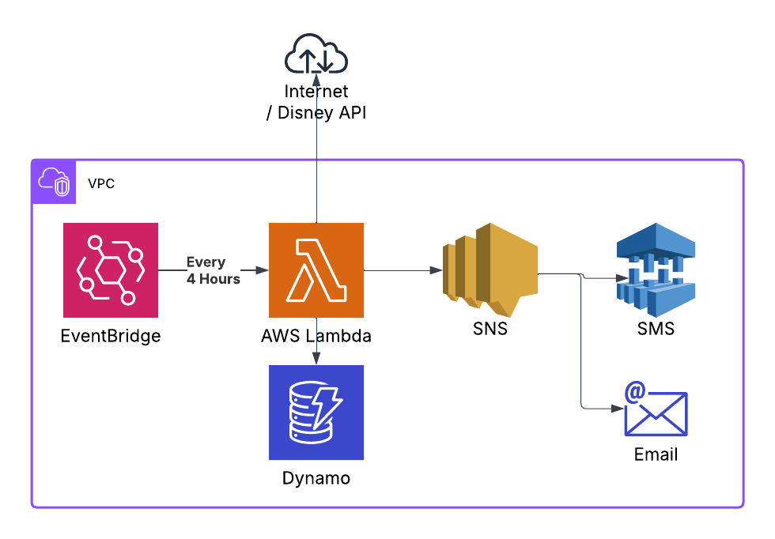

# Summary

Application to notify users when Disney hotels become available below desired prices.



## Methodology

1. Event Bridge invokes the scrapper lambda every four hours
2. The Lambda pulls resort prices from the Disney API
3. Resorts are filtered based on the maximum price a client is willing to pay
4. Prices from the last check in DynamoDB are compared and filtered out if the price has not dropped
5. Matching resorts are sent to the SNS topic
6. The SNS topic sends messages to targets like Email and SMS for mobile notifications

## Infrastructure

Setup infrastructure as follows:

1. Define an SNS topic to be used commonly across projects
2. Create the CloudFormation from the [cloudformation.yml](./cloudformation.yml)

## Configuration

The event bridge rule may be configured to input JSON to the lambda given the following parameters:

- `check_in_date`: Hotel Check-in date (YYYY-mm-dd)
- `check_out_date`: Hotel Check-out date (YYYY-mm-dd)
- `adult_count`: Number of adults $a\in\mathbb{N}$
- `child_count`: Number of children $c\in\mathbb{N}$
- `max_price`: Maximum price allowed for reservation $\{ m\in\mathbb{R} \mid a>0 \}$
- `exclude_resorts`: Resorts to exclude by name as a substring of the restort

```json
[
  {
    "check_in_date": "2025-04-04",
    "check_out_date": "2025-04-05",
    "adult_count": 2,
    "child_count": 0,
    "max_price": 300,
    "exclude_resorts": ["Art of Animation"]
  }
]
```

## Run

You can run the application locally using the `lambda_handler`:

```shell
python disney_scapper/lambda_handler.py
```

## Package

Package the application for release into an AWS Lambda by installing dependencies and running the pythong packager plugin.

```shell
poetry install
poetry build-lambda
```

## Dependencies

Ensure you have the following dependencies installed:

- [Poetry](https://python-poetry.org/)
- [Poetry Lambda-Build](https://github.com/micmurawski/poetry-plugin-lambda-build)

    ```shell
    poetry self add poetry-plugin-lambda-build
    poetry self add poetry-plugin-export
    ```

License

This project is licensed under MIT.